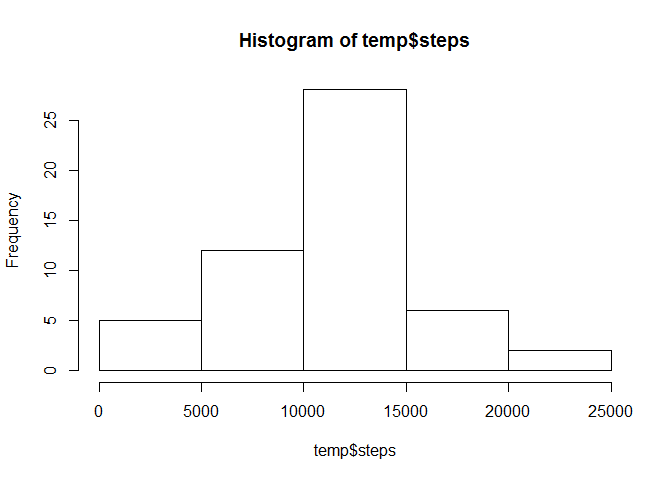

# Peer Assessment One
Catherine Petersen  
Monday, December 14, 2015  

This is an analysis of movement patterns by five minute intervals over X days

The data is loaded, checked, and modified as needed for the analysis

```r
##Load the data
activity <- read.csv("C:/Users/Catie/Desktop/activity.csv")

##take a look around
summary (activity)
```

```
##      steps                date          interval     
##  Min.   :  0.00   2012-10-01:  288   Min.   :   0.0  
##  1st Qu.:  0.00   2012-10-02:  288   1st Qu.: 588.8  
##  Median :  0.00   2012-10-03:  288   Median :1177.5  
##  Mean   : 37.38   2012-10-04:  288   Mean   :1177.5  
##  3rd Qu.: 12.00   2012-10-05:  288   3rd Qu.:1766.2  
##  Max.   :806.00   2012-10-06:  288   Max.   :2355.0  
##  NA's   :2304     (Other)   :15840
```

```r
##get date formatted correctly
activity$date <- as.Date(activity$date)
```


The first descriptive statistics include the average number of steps per day


```r
##find the average number of steps per day
temp <- aggregate(steps ~ date,sum,data = activity)

##histogram of total number of steps per day
hist(temp$steps)
```

 

```r
##mean and median of steps per day
mean(temp$steps)
```

```
## [1] 10766.19
```

```r
median(temp$steps)
```

```
## [1] 10765
```

A time series plot shows the pattern seen in activity throughout the day.


```r
##time series plot for daily activity
library(ggplot2)
```

```
## Warning: package 'ggplot2' was built under R version 3.1.3
```

```r
ggplot(activity, aes(interval,steps)) + geom_point() + geom_smooth()
```

```
## geom_smooth: method="auto" and size of largest group is >=1000, so using gam with formula: y ~ s(x, bs = "cs"). Use 'method = x' to change the smoothing method.
```

```
## Warning: Removed 2304 rows containing missing values (stat_smooth).
```

```
## Warning: Removed 2304 rows containing missing values (geom_point).
```

 

A spike is seen early in the day and steps drop off significantly on either side of midnight.  The average steps per interval reveals what part of the day is usually the most active.


```r
##find the average number of steps per interval
temp2 <- aggregate(steps ~ interval, mean, data = activity)

#find the interval that has the highest average steps
maxi <- max(temp2$steps)
temp3 <- subset(temp2, steps == maxi)
temp3[1]$interval
```

```
## [1] 835
```

The peak of activity is at 8:35am.  

The data has missing values for steps which can skew the results.  


```r
##count of missing values
sum(is.na(activity$steps))
```

```
## [1] 2304
```

The missing values are replaced with the mean number of steps for that interval across the data set.


```r
##replace missing values with average steps for that interval
activity2 <- activity
missingtemp <- subset(activity2, is.na(steps))
finetemp <- subset(activity2, !(is.na(steps)))

i <- 1
x <- 1
n <- nrow(activity2)
m <- nrow(temp2)

while (i <= n){
  while (x <= m){
  track <- which(missingtemp$interval == temp2$interval[x])
  missingtemp$steps[track]<- temp2$steps[x]
x <- x + 1
}
i <- i + 1
}

activity2 <- rbind(missingtemp, finetemp)


#validate there are no more missing values
sum(is.na(activity2$steps))
```

```
## [1] 0
```

With the NAs removed, the analysis can be rerun to see where there are differences.


```r
##find the average number of steps per day with NAs removed
newtemp <- aggregate(steps ~ date,sum,data = activity2)

##histogram of total number of steps per day with NAs removed
hist(newtemp$steps)
```

 

```r
##mean and median of steps per day with NAs removed
mean(newtemp$steps)
```

```
## [1] 10766.19
```

```r
median(newtemp$steps)
```

```
## [1] 10766.19
```

The replaced missing values had a small effect on the mean and median values for steps.

Activity patterns are often different between the weekend and weekdays.  Adding a feature for the type of day allows for analysis of patterns at different points in the week.


```r
##identify weekdays and weekends
activity2$daytype <- weekdays(activity2$date)

i <- 1
n <- nrow(activity2)
activity2$weekend <- 0

while (i <= n) {
  if(activity2$daytype[i] == 'Saturday' | activity2$daytype[i] == 'Sunday') 
    {(activity2$weekend[i]<- TRUE)} 
  else (activity2$weekend[i]<- FALSE)
  i <- i + 1
}
```

A panel plot allows a comparison of weekday and weekend behaviors.


```r
##panel plot comparing daily activity patterns on weekdays and weekends
ggplot(activity2, aes(interval,steps)) + geom_point() + geom_smooth() + facet_wrap(~weekend, nrow=1)
```

```
## geom_smooth: method="auto" and size of largest group is >=1000, so using gam with formula: y ~ s(x, bs = "cs"). Use 'method = x' to change the smoothing method.
## geom_smooth: method="auto" and size of largest group is >=1000, so using gam with formula: y ~ s(x, bs = "cs"). Use 'method = x' to change the smoothing method.
```

 

The plots show that there is a difference in behavior between weekday and weekend days.  The weekdays shows a stronger peak in the morning, possibly due to getting ready for a job or school, while the weekends show a steadier activity level.

